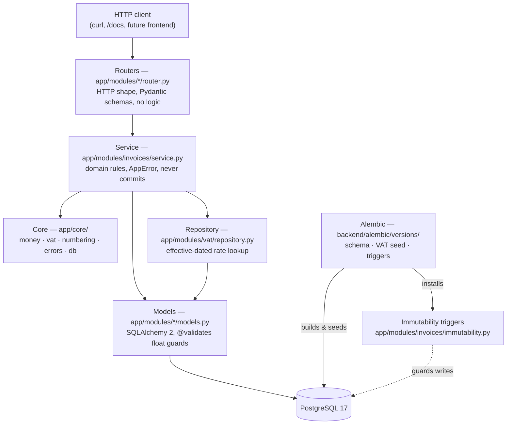

# Architecture

How the backend is put together, and why. Current as of Phase 2 (the backend is
feature-complete; the frontend is a scaffold only — see
[PHASE-PLAN.md](PHASE-PLAN.md)).

## Layers



The rule the layering enforces: **money arithmetic happens only in `app/core/`**
(`money.py`, `vat.py`). Routers and models never compute money; services
orchestrate but delegate every calculation to core.

## Module map

### `app/core/`

| File | Responsibility |
| --- | --- |
| `config.py` | `Settings` (pydantic-settings) — `DATABASE_URL` from env / `backend/.env`. |
| `db.py` | Engine, `SessionLocal`, declarative `Base`, the `get_session` request dependency, and `check_db()` for `/health`. |
| `errors.py` | `AppError`, the machine-code constants, and the handlers producing the uniform error body. |
| `mixins.py` | `TimestampMixin` — server-managed `created_at` / `updated_at`. |
| `money.py` | Money primitives: `round_money`, `as_decimal`, `reject_float`, and the precision conventions. See [MONEY.md](MONEY.md). |
| `vat.py` | The pure VAT engine: `VatRateCode`, `LineInput`, `RateGroup`, `InvoiceTotals`, `compute_totals`. No DB access. |
| `numbering.py` | `allocate_number` (gapless, row-locked), `format_invoice_number`, `invoice_sequence_key`. |

### `app/modules/`

| File | Responsibility |
| --- | --- |
| `clients/models.py` | `Client` — master data with `archived_at` (archive, never delete). |
| `clients/schemas.py` | Client request/response schemas. |
| `clients/router.py` | `/clients` CRUD plus `/archive` and `/unarchive`. |
| `company/models.py` | `CompanyProfile` — the seller; a single row with `id = 1`, enforced by CHECK. |
| `company/schemas.py` | Company profile upsert/read schemas. |
| `company/router.py` | `GET` / `PUT /company-profile`. |
| `invoices/models.py` | `Invoice` and `InvoiceLine` — inputs only, no computed money columns; JSONB `snapshot`; partial unique index on `number`. |
| `invoices/schemas.py` | Invoice schemas; every money field is `Decimal` with `allow_inf_nan=False`. |
| `invoices/service.py` | Draft CRUD, totals, and the money-critical `issue_invoice` / `void_invoice`. |
| `invoices/immutability.py` | The trigger DDL, as a single shared constant (see below). |
| `invoices/router.py` | `/invoices` CRUD plus `/totals`, `/issue`, `/void`. |
| `numbering/models.py` | `NumberSequence` — the persistent per-year counter. |
| `vat/models.py` | `VatRate` — effective-dated reference data; owns the shared `vat_rate_code` Postgres enum. |
| `vat/repository.py` | `rates_on(session, date)` — the applicable rate for every code on a date. |
| `models.py` | Model registry: importing it populates `Base.metadata` for Alembic and the test harness. |
| `main.py` | `create_app()` — mounts `/health` and the routers under `/api/v1`. |

## The transaction model

`get_session` (in `app/core/db.py`) is the only place a transaction is opened or
closed:

```python
session = SessionLocal()
try:
    yield session
    session.commit()      # success -> commit, once, at the end of the request
except Exception:
    session.rollback()    # any error -> the whole request is undone
    raise
finally:
    session.close()
```

**One request is one transaction.** Services call `session.flush()` when they
need generated IDs, but they never commit — deliberately. That single rule is
what makes issue atomic:

`issue_invoice` allocates a gapless number partway through its work. If anything
after that point fails — a missing VAT rate, a database error, a bug — the
request's transaction rolls back and the sequence increment rolls back with it.
The number is returned to the sequence rather than burned, and the next issue
reuses it. There is a test for exactly this
(`test_failed_issue_does_not_burn_a_number`).

If a service committed on its own, a later failure would leave a consumed number
with no invoice attached to it — a gap in a sequence that UK invoicing requires
to be gapless. Hence: **services never commit.**

## The error model

Every handled error is rendered as one shape, so a client can branch on a stable
machine code instead of parsing prose:

```json
{"detail": {"code": "invoice_not_draft", "message": "Only draft invoices can be edited."}}
```

Services raise `AppError(status_code, code, message)`; handlers registered by
`register_error_handlers(app)` turn it into that body. Pydantic request
validation failures are collapsed into the same shape with code
`validation_failed`, keeping the full Pydantic error list under an extra
`errors` key for debugging.

| Code | Status | Raised when |
| --- | --- | --- |
| `not_found` | 404 | The invoice, client, or company profile does not exist. |
| `client_archived` | 409 | Creating/editing an invoice for an archived client, or issuing one. |
| `invoice_not_draft` | 409 | Editing, deleting, or issuing an invoice that is not a draft. |
| `invoice_not_issued` | 409 | Voiding an invoice that is not in `issued`. |
| `validation_failed` | 422 | Request body validation, no lines at issue, or no VAT rate at the tax point. |
| `company_profile_missing` | 409 | Issuing before the seller's company profile has been saved. |

The codes are defined once in `app/core/errors.py`; this table mirrors them.

## Migrations and triggers

Three migrations, applied in order:

1. `5f7da3d0e4dd` — schema: company profile, clients, VAT rates, invoices, numbering.
2. `de303147f0cb` — seed: the four UK VAT rates, effective 2011-01-04, open-ended.
3. `14438b1216ca` — the immutability triggers.

**Postgres ENUMs need explicit lifecycle management in Alembic.** Autogenerate
renders `sa.Enum(...)` inline per table; `upgrade` then works, but `downgrade`
drops the tables and leaves the enum *types* behind, so a re-`upgrade` fails with
`DuplicateObject`. The schema migration therefore declares each enum at module
level with `create_type=False` and calls `.create(bind, checkfirst=True)` /
`.drop(bind, checkfirst=True)` explicitly. CI runs `alembic upgrade head` then
`alembic downgrade base` on every push to keep this honest.

**The trigger DDL lives in application code, not in the migration.**
`app/modules/invoices/immutability.py` exports `IMMUTABILITY_UP_SQL` and
`IMMUTABILITY_DOWN_SQL`; the migration executes them, and so does the test
harness, which builds its schema from model metadata rather than by migrating.
Two copies of that SQL would eventually drift, and the copy the tests exercised
would not be the copy production ran. Extend the constant rather than adding a
delta migration with divergent SQL.

What the triggers enforce is documented in
[INVOICING.md](INVOICING.md#immutability-in-three-layers).
