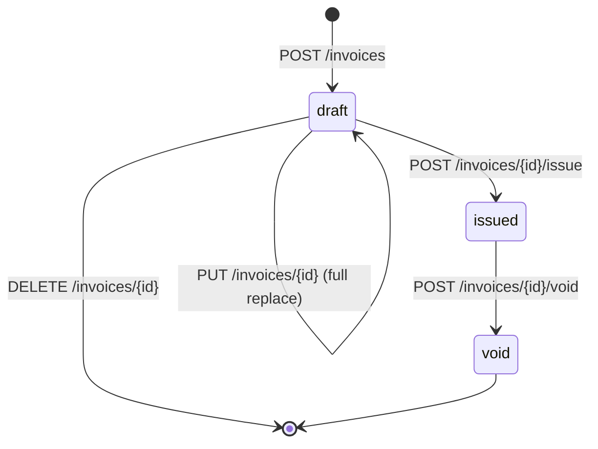

# Invoicing rules

The domain rules an invoice has to obey, and where each one is enforced. Money
mechanics live in [MONEY.md](MONEY.md).

## Lifecycle



| State | Number | Snapshot | Editable | Deletable |
| --- | --- | --- | --- | --- |
| `draft` | none | none | yes, full replace | **yes** — the one legitimate delete |
| `issued` | allocated, permanent | written once | no (409) | no (409) |
| `void` | kept | kept | no (409) | no (409) |

A draft is scratch paper: it stores only inputs, has no number, no fixed dates,
and no stored money. Deleting one destroys nothing of record. Everything else is
a document of record and is never deleted — `void` is how an issued invoice is
withdrawn.

There is no `void → issued` transition and no way back to `draft`. Reissuing
means creating a new invoice, which takes the next number.

## Gapless numbering

UK invoicing requires unique, sequential numbers. This repo uses **per-year
sequences**, so numbering resets cleanly each January while staying unique
overall:

```
INV-{year}-{seq:05d}      e.g. INV-2026-00001
```

The counter is a row in `number_sequence`, keyed `invoice-{year}`.
`allocate_number` does three things inside the caller's transaction:

1. `INSERT ... ON CONFLICT DO NOTHING` to create the row if this is the year's
   first invoice, without racing another transaction doing the same;
2. `SELECT ... FOR UPDATE` to take a row lock, serialising concurrent
   allocators on that key;
3. return `next_value` and increment it.

**Numbers are allocated only at issue**, and only after every validation has
passed — never on draft creation.

### The rollback contract

`allocate_number` must run inside the caller's transaction, and the caller must
not commit until the number is durably written onto the invoice. This is what
makes the sequence gapless rather than merely unique:

> Because the increment lives in the same transaction as the work that consumes
> the number, a rollback undoes the increment too. A failed issue never burns a
> number — the next issue reuses it.

`test_failed_issue_does_not_burn_a_number` proves it: a draft whose client was
archived fails to issue with 409, and the next successful issue still gets
`00001`. This is also why services never commit; see
[ARCHITECTURE.md](ARCHITECTURE.md#the-transaction-model).

`allocate_number` is **PostgreSQL-only by design**. The create-if-missing step
depends on `ON CONFLICT DO NOTHING`. Rewriting it as a portable
SELECT-then-INSERT would reintroduce exactly the create race it closes; the
project targets PostgreSQL only.

### Voided numbers stay consumed

Voiding leaves both the number and the snapshot untouched. Under UK sequential
numbering the sequence must have no holes, so a voided number is spent, not
reclaimed. A void is a visible cancelled document, not an erasure.

## The snapshot

At issue, everything the invoice needs is frozen into the `snapshot` JSONB
column: seller, client, lines, rates, and totals as they were at that moment.
Later edits to master data — the client moves, the company renames, a VAT rate
changes — cannot alter an issued invoice, because nothing about it is read from
master data again.

**Write once, read verbatim.** `GET /invoices/{id}` serves an issued or void
invoice's money straight from the snapshot; it is never recomputed. Phase 4's
PDF will render from this structure and nothing else.

### Shape v1

A real snapshot, captured from a running instance (demo data, nothing redacted):

```json
{
  "version": 1,
  "number": "INV-2026-00001",
  "invoice_date": "2026-07-20",
  "tax_point_date": "2026-07-20",
  "due_date": "2026-08-19",
  "currency": "GBP",
  "seller": {
    "trading_name": "Bramble Studio Ltd",
    "address_line1": "12 Fenchurch Avenue",
    "address_line2": null,
    "city": "London",
    "postcode": "EC3M 5BN",
    "country": "GB",
    "vat_number": "GB123456789",
    "company_number": "09876543",
    "email": "hello@bramble.studio",
    "phone": null,
    "bank_account_name": "Bramble Studio Ltd",
    "bank_sort_code": "04-00-04",
    "bank_account_number": "12345678"
  },
  "client": {
    "name": "Harbour Analytics Ltd",
    "address_line1": "4 Dock Road",
    "address_line2": null,
    "city": "Bristol",
    "postcode": "BS1 6EG",
    "country": "GB",
    "vat_number": "GB987654321",
    "email": null
  },
  "lines": [
    {
      "position": 1,
      "description": "Discovery workshop",
      "quantity": "2.000",
      "unit_price": "650.0000",
      "vat_rate_code": "standard",
      "rate": "0.2000",
      "line_net": "1300.00"
    },
    {
      "position": 2,
      "description": "Printed report",
      "quantity": "10.000",
      "unit_price": "12.5000",
      "vat_rate_code": "zero",
      "rate": "0.0000",
      "line_net": "125.00"
    }
  ],
  "groups": [
    {"code": "standard", "rate": "0.2000", "net": "1300.00", "vat": "260.00", "gross": "1560.00"},
    {"code": "zero",     "rate": "0.0000", "net": "125.00",  "vat": "0.00",   "gross": "125.00"}
  ],
  "totals": {"net": "1425.00", "vat": "260.00", "gross": "1685.00"}
}
```

| Field | Notes |
| --- | --- |
| `version` | Snapshot shape version. Currently `1`. |
| `number` | The allocated invoice number, also mirrored on the `invoice.number` column. |
| `invoice_date` | Date of issue. Defaults to today; may be supplied in the issue request. |
| `tax_point_date` | Governs which VAT rates were used. Defaults to `invoice_date`. |
| `due_date` | Payment due date, or `null`. |
| `currency` | `GBP` only (a CHECK constraint enforces it). |
| `seller` | Copy of the company profile — 13 fields including bank details. |
| `client` | Copy of the client — 8 fields. |
| `lines` | Per line: `position`, `description`, `quantity`, `unit_price`, `vat_rate_code`, the resolved `rate`, and the computed `line_net`. |
| `groups` | Per rate group in canonical order: `code`, `rate`, `net`, `vat`, `gross`. |
| `totals` | Invoice-level `net`, `vat`, `gross`. |

**Every money, quantity, and rate value is a JSON string.** JSON numbers are
floats in most parsers, and floats are banned from money — see
[MONEY.md](MONEY.md#three-enforcement-layers). A database-level test asserts
`jsonb_typeof(snapshot->'totals'->'net') = 'string'`, so this cannot regress
into numbers unnoticed.

### Version-bump policy

`SNAPSHOT_VERSION` lives in `app/modules/invoices/service.py`. Existing
snapshots are never rewritten — they are the record of what was issued — so any
reader must branch on `version`.

Bump it for any change that a reader could trip over: removing or renaming a
field, changing a value's type or units, or changing the meaning of an existing
field. Purely additive optional fields do not require a bump, but a reader must
not assume they are present on older snapshots.

## Immutability in three layers

Each layer catches what the one above it might miss.

**1. Schema shape.** Drafts store inputs only — there are no computed money
columns anywhere on `invoice` or `invoice_line`. There is nothing stale to go
out of sync, because computed money exists in exactly one place: the snapshot,
written once. The partial unique index `uq_invoice_number ... WHERE number IS
NOT NULL` keeps numbers unique among issued invoices while allowing any number
of null-numbered drafts.

**2. Service layer.** `replace_draft`, `delete_draft`, and `issue_invoice`
reject anything that is not a draft with `409 invoice_not_draft`; `void_invoice`
rejects anything not `issued` with `409 invoice_not_issued`. `issue_invoice`
loads the row `FOR UPDATE`, so two concurrent issues of the same draft serialise
and the second sees `issued`.

**3. Database triggers.** A tripwire, not the primary enforcement: they fire even
if a bug, a migration, or a direct `psql` session bypasses the API entirely.
Their DDL lives in `app/modules/invoices/immutability.py` and is executed by
both the migration and the test harness, so the two can never drift.

| Trigger | Fires on | Blocks |
| --- | --- | --- |
| `trg_invoice_immutable` | `BEFORE UPDATE ON invoice` | Any update to a non-draft row except `issued → void` with every other column unchanged (checked field by field with `IS NOT DISTINCT FROM`). Drafts stay freely mutable, including `draft → issued`. |
| `trg_invoice_no_delete` | `BEFORE DELETE ON invoice` | Deleting any invoice that is not a draft. |
| `trg_invoice_line_immutable` | `BEFORE INSERT OR UPDATE OR DELETE ON invoice_line` | Inserting, updating, or deleting a line whose parent invoice is not a draft. |

`INSERT` and the invoice-level `DELETE` guard were added after code review found
two holes: a raw `INSERT INTO invoice_line` could append a line to an issued
invoice, and a raw `DELETE FROM invoice` removed an issued invoice whose lines
then slipped through the line trigger's "parent already gone" branch. All three
are exercised by tests that bypass the API and go straight to SQL.

What this looks like in practice:

```
$ psql -c "UPDATE invoice_line SET description='hacked' WHERE invoice_id=1;"
ERROR:  invoice_line of invoice 1 is immutable (invoice status=void)

$ psql -c "DELETE FROM invoice WHERE id=1;"
ERROR:  invoice 1 cannot be deleted (status=void): only drafts are deletable
```

## Clients: archive, never delete

Clients are archived (`archived_at` set), never hard-deleted, so issued invoices
keep a valid reference. The API has no delete endpoint for clients at all.

- Creating or editing an invoice for an archived client → `409 client_archived`.
- Issuing an invoice whose client was archived after the draft was made → `409 client_archived`.
- Previously issued invoices stay fully readable — they render from the
  snapshot, which holds the client's details as they were.
- `POST /clients/{id}/unarchive` reverses it.

## UK invoice content requirements

A UK VAT invoice must carry specific information. Every item below is already
captured in the snapshot, which is what the Phase 4 PDF will render:

| Requirement | Where it lives |
| --- | --- |
| Unique sequential invoice number | `snapshot.number` |
| Date of issue | `snapshot.invoice_date` |
| Tax point (time of supply) | `snapshot.tax_point_date` |
| Seller name and address | `snapshot.seller.trading_name`, `address_line1`, `address_line2`, `city`, `postcode`, `country` |
| Seller VAT registration number | `snapshot.seller.vat_number` |
| Customer name and address | `snapshot.client.*` |
| Description of goods/services per line | `snapshot.lines[].description` |
| Quantity and unit price per line | `snapshot.lines[].quantity`, `unit_price` |
| VAT rate applied per line | `snapshot.lines[].vat_rate_code`, `rate` |
| Amount excluding VAT per line | `snapshot.lines[].line_net` |
| VAT breakdown per rate | `snapshot.groups[]` |
| Total excluding VAT / total VAT / gross | `snapshot.totals.net`, `.vat`, `.gross` |
| Payment details | `snapshot.seller.bank_account_name`, `bank_sort_code`, `bank_account_number` |

Company registration number (`snapshot.seller.company_number`) is carried too —
required on business stationery for a registered company rather than by VAT
rules specifically.

> This is a proof of concept, not tax advice. Anyone invoicing for real should
> check the current HMRC guidance for their circumstances.
